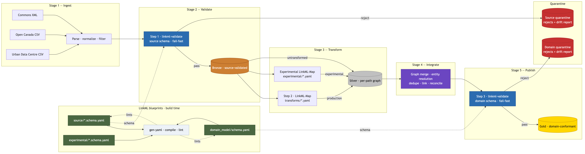
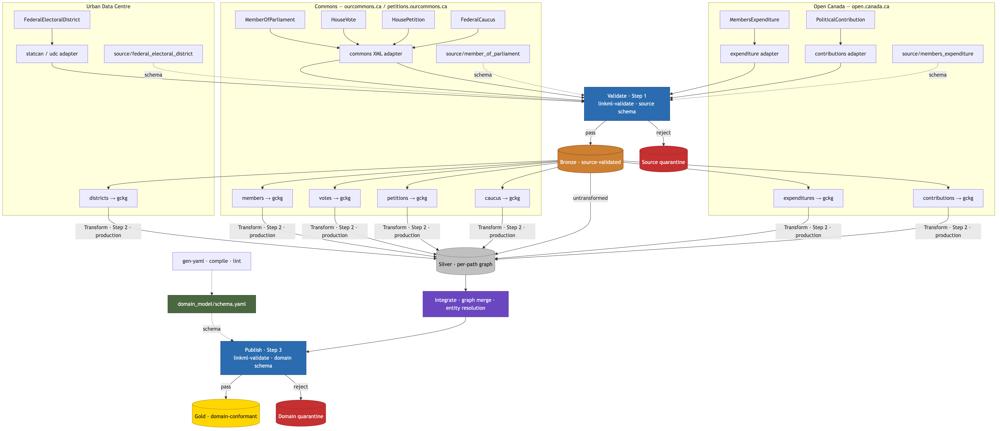

# GCKG — Canadian Governments Knowledge Graph

A schema-first knowledge graph that unifies Canadian federal parliamentary and open-government data into a single, validated, queryable graph.

## Background

Federal political data in Canada is published across multiple systems with different formats, update cadences, and identifiers. Each source is authoritative for its domain, but none was designed to interoperate. The same person, district, or organization appears under different names and keys in different datasets. Without a shared domain model and a disciplined ingest pipeline, cross-source analysis requires ad hoc joins, brittle one-off scripts, and manual reconciliation whenever a publisher changes shape.

GCKG addresses that fragmentation by treating the knowledge graph as a product: typed entities and relationships, explicit provenance, and validation at every boundary.

## Objective

Build a reproducible pipeline that ingests heterogeneous Canadian government sources and produces a **domain-conformant knowledge graph** suitable for research, civic tooling, and downstream applications (SPARQL, graph databases, API layers).

## Success criteria

The project succeeds when:

1. **Multi-source coverage** — At least the Commons, Open Canada, and Urban Data Centre source families flow through the pipeline and land in a merged working graph.
2. **Schema discipline** — Every record is validated against LinkML schemas at ingest (source shape) and publish (domain shape); drift is caught early and rejected records are quarantined with a report.
3. **Declarative transforms** — Field remapping from source to domain is defined in LinkML-Map YAML, not buried in procedural code.
4. **Integrated graph** — Entity resolution and merge produce a single reconciled graph where the same person, district, or organization resolves to one identifier across sources.
5. **Gold-tier output** — Published data passes domain validation and contains only graph-native, domain-conformant assertions.
6. **Reproducibility** — A run can be repeated with the same inputs and schemas to produce an auditable, versioned output.

## Proposed solution

GCKG uses a five-stage medallion pipeline driven by LinkML blueprints at build time and `linkml-validate` at runtime.



Diagram source: [`gckg.mmd`](docs/milestone_1/gckg.mmd).

### Build time — LinkML blueprints

Source schemas, domain model, and experimental schemas are compiled and linted with `gen-yaml`. These blueprints define what valid source rows and domain entities look like before any data moves through the pipeline.

### Runtime stages

| Stage | Purpose | Tier |
|-------|---------|------|
| **1 — Ingest** | Parse, normalize, and filter raw publisher data | — |
| **2 — Validate** | `linkml-validate` against source schema; fail-fast on drift | Bronze |
| **3 — Transform** | LinkML-Map declarative translation (production or experimental) | Silver |
| **4 — Integrate** | Graph merge, dedupe, entity resolution, cross-source linking | Silver (merged) |
| **5 — Publish** | `linkml-validate` against domain schema | Gold |

Records that fail validation at Stage 2 or Stage 5 are routed to **quarantine** with a drift report rather than silently corrupting downstream tiers.

### Design principles

- **Schema-first** — LinkML is the contract between sources, transforms, and the domain model.
- **Fail-fast gates** — Validate at Bronze (source) and Gold (domain); do not propagate bad rows.
- **Separation of concerns** — Adapters handle publisher format; LinkML-Map handles remapping; Integrate handles cross-source reconciliation.
- **Experimental lane** — New transforms can be tested alongside production mappings before promotion to the domain schema.

## Milestone 1 — Ingestion pipeline (Stage 1)

### Workflow



**Goal:** Stage 1 (Ingest) — a Python runner and adapters that emit source-shaped `records.jsonl` and a provenance `manifest.json` under `staging/`.

**Status:** In progress. Platform and two adapters are implemented; four sources remain stubs.

Execution plan: [`docs/milestone_1/commons-members-execution-plan.md`](docs/milestone_1/commons-members-execution-plan.md)

| Phase | Work | Status | Output |
|-------|------|--------|--------|
| **1 — Platform** | `pyproject.toml`, `python -m ingest`, adapter protocol + registry, fetch/cache, `ingest/config/sources.yaml`, staging layout, pytest | Done | `python -m ingest run --source …` |
| **2 — MPs** | `commons_members`: HTTP/local-file fetch, XML parse, schema-driven field map, normalize | Done | `staging/commons_members/{run_id}/` |
| **3 — Contributions** | `open_canada_federal_election_contribution`: local-file CSV, parse/normalize/filter | Done | Staging runs from manually extracted CSV |
| **4 — Expenditure** | `open_canada_expenditure` CSV adapter | Not started | Stub only |
| **5 — Commons** | `commons_votes`, `commons_petitions` (reuse `xml_utils`) | Not started | Stubs only |
| **6 — Districts** | `udc_districts` | Not started | Stub only |
| **7 — Hardening** | `run-all`, schema-driven maps for remaining adapters, bulk CSV path | Not started | — |

### Registered sources (today)

```bash
python -m ingest list-sources
# commons_members
# open_canada_federal_election_contribution
```

| Source | Module | Fetch | Notes |
|--------|--------|-------|-------|
| `commons_members` | `ingest/adapters/commons/members.py` | HTTP (`default`/`refresh`) or `local-file` | Field map from `source/commons_members.schema.yaml` via `gckg:publisher_header` |
| `open_canada_federal_election_contribution` | `ingest/adapters/open_canada/contribution.py` | **`local-file` only** (`local_only: true`) | Elections Canada zip must be downloaded and extracted manually |
| `commons_votes`, `commons_petitions`, `open_canada_expenditure`, `udc_districts` | stubs | — | Not implemented |

### Adapter order (remaining)

```
open_canada_expenditure → commons_votes → commons_petitions → udc_districts
```

### Done when

- [x] Ingest platform: CLI, registry, fetch policies, staging layout
- [x] `commons_members` adapter + unit tests (`ingest/tests/adapters/test_commons_members.py`)
- [x] `open_canada_federal_election_contribution` adapter (local-file)
- [x] Source schema for members: `source/commons_members.schema.yaml`
- [x] Schema-driven field map helper: `ingest/schema.py`
- [ ] All six adapters registered and producing staging output
- [ ] Contributions and other CSV adapters use schema-driven maps like members
- [ ] `run-all` orchestration for multi-source ingest
- [ ] Unit tests for all implemented adapters — no network in CI
- [ ] No GCKG domain IDs or cross-entity joins in Stage 1 output

## Milestone 2 — Validate pipeline (Stage 2 / Bronze)

**Goal:** Validate Stage 1 `records.jsonl` against LinkML **source schemas** (`source/*.schema.yaml`), write **Bronze** (source-validated records), and route failures to **quarantine** with a drift report.

**Status:** In progress. Validate platform and the `commons_members` gate are implemented; tests and additional source schemas remain.

Execution plan: [`docs/milestone_2/validate-execution-plan.md`](docs/milestone_2/validate-execution-plan.md)

| Phase | Work | Status | Output |
|-------|------|--------|--------|
| **1 — Platform** | `validate/` package: CLI, runner, engine, context, errors, `validate/config/schemas.yaml` | Done | `python -m validate run …` |
| **2 — Members gate** | `source/commons_members.schema.yaml` (`CommonsMembersRow`), validate staging → Bronze | Done | `bronze/commons_members/{run_id}/` |
| **3 — Contributions gate** | `source/open_canada_federal_election_contribution.schema.yaml`, register in `schemas.yaml` | Not started | Bronze for contributions staging |
| **4 — Tests** | Engine unit tests, ingest→validate integration on fixtures | Not started | `validate/tests/` |
| **5 — Packaging** | Add `validate` to `pyproject.toml`, `linkml` dependency, `validate` console script | Not started | `pip install -e ".[validate]"` |
| **6 — Hardening** | Catalog validation (ingest sources ∩ schema registry), progress logging for large JSONL | Partial | `--fail-fast` supported |

### How Stage 2 works

1. Read `staging/{source}/{staging_run_id}/records.jsonl` and `manifest.json` (no re-fetch from publishers).
2. Load LinkML source schema from `validate/config/schemas.yaml`.
3. Stream JSONL line-by-line; validate each record with `linkml.validator.Validator`.
4. **Accepted rows** → `bronze/{source}/{run_id}/records.jsonl` + `manifest.json`
5. **Rejected rows** → `quarantine/{source}/{run_id}/rejects.jsonl` + `drift_report.json`

Bronze records are identical to accepted staging rows — no domain IDs, no transform (that is Stage 3).

### Handoff

```text
staging/{source}/{run_id}/records.jsonl
  →  python -m validate run --source … --staging-run-id …
  →  bronze/{source}/{run_id}/records.jsonl
  →  quarantine/{source}/{run_id}/rejects.jsonl + drift_report.json  (if any rejects)
```

### Example

```bash
# Stage 1
python -m ingest run --source commons_members \
  --fetch-policy local-file \
  --input ingest/tests/fixtures/raw/commons_members_sample.xml \
  --run-id m2-test

# Stage 2
python -m validate run --source commons_members --staging-run-id m2-test
```

### Validatable sources (today)

```bash
python -m validate list-sources
# commons_members
```

Requires `linkml` installed (`pip install linkml`). Run from repo root so `source/` schema paths resolve.

### Done when

- [x] `source/commons_members.schema.yaml` defines `CommonsMembersRow`
- [x] Staging rows validate; accepted records land in `bronze/`
- [x] Rejected rows and `drift_report.json` land in `quarantine/`
- [ ] `pyproject.toml` includes `validate` package and LinkML dependency
- [ ] `validate/tests/` with offline fixtures
- [ ] Contributions source schema and Bronze path
- [ ] Schema registry covers every implemented ingest source

## Milestone 3 — Transform pipeline (Stage 3 / Silver)

**Goal:** Transform Bronze records into **Silver graph fragments** using declarative **LinkML-Map** (`transforms/*.yaml`) and materializers, introducing GCKG domain IDs and typed entities/relationships.

**Status:** Not started.

Execution plan: [`docs/milestone_3/transform-execution-plan.md`](docs/milestone_3/transform-execution-plan.md)

| Phase | Work | Status | Output |
|-------|------|--------|--------|
| **0 — Domain prep** | Extend `house_of_commons.yaml` (membership, tenure); finance classes for contributions | Not started | `gen-yaml` passes |
| **1 — Platform** | `transform/` package: CLI, runner, context, config registry, silver layout | Not started | `python -m transform run …` |
| **2 — IDs + provenance** | Deterministic URI builders, `wasDerivedFrom` on every fragment | Not started | `transform/ids.py`, `transform/provenance.py` |
| **3 — Members map** | `transforms/commons_members_to_gckg.yaml` + materializer | Not started | Person, Seat, Role, Party, triples from one Bronze row |
| **4 — Contributions map** | Finance/election map + streaming materializer | Not started | Second source path |
| **5 — Experimental lane** | Opt-in `experimental/*.yaml` maps via CLI flag | Not started | Safe map iteration |
| **6 — Tests + packaging** | Golden Silver fixtures, bronze→silver integration, `pyproject.toml` | Not started | `transform/tests/` |

### How Stage 3 works

1. Read `bronze/{source}/{bronze_run_id}/records.jsonl` and Bronze `manifest.json`.
2. Load LinkML-Map from `transform/config/maps.yaml` (or `--map` override).
3. Stream Bronze JSONL; for each row, apply map + **materializer** (multi-object graph expansion).
4. Write **`silver/{source}/{run_id}/fragments.jsonl`** — one graph object per line (Person, Triple, …).
5. Write **`silver/{source}/{run_id}/manifest.json`** with fragment counts and provenance to Bronze.

Silver is **per-source** graph fragments. Cross-source merge is Stage 4 (Integrate).

### Handoff

```text
bronze/{source}/{run_id}/records.jsonl
  →  python -m transform run --source … --bronze-run-id …
  →  silver/{source}/{run_id}/fragments.jsonl
```

### Example (once implemented)

```bash
python -m transform run --source commons_members --bronze-run-id m3-test
```

### Done when

- [ ] `commons_members` Bronze row materializes Person + Seat + Role + Party + tenure triples
- [ ] GCKG IDs are deterministic and source-scoped
- [ ] Every Silver fragment carries provenance back to Bronze
- [ ] `transforms/commons_members_to_gckg.yaml` in production; experimental lane available
- [ ] `pytest transform/tests` passes offline

## File layout

```
gckg/
├── pyproject.toml
│
├── domain_model/                           LinkML domain schema · Stage 5 Publish gate
│   ├── schema.yaml                         root import
│   ├── foundation/
│   │   ├── prefixes.yaml
│   │   └── types.yaml                      Person, Organization, Role, …
│   └── domains/
│       └── house_of_commons.yaml           MPs, districts, caucus
│
├── source/                                 LinkML source schemas · Stage 2 Validate gate
│   └── commons_members.schema.yaml         CommonsMembersRow (+ publisher_header annotations)
│
├── experimental/                           draft LinkML maps · Stage 3 (opt-in)
│   └── *.yaml
│
├── transforms/                             LinkML-Map · Stage 3 Transform (production)
│   └── commons_members_to_gckg.yaml
│
├── transform/                              Python package · Stage 3 Transform (planned)
│   ├── cli.py
│   ├── runner.py
│   ├── engine.py
│   ├── ids.py
│   ├── config/maps.yaml
│   └── materializers/
│
├── ingest/                                 Python package · Stage 1 Ingest
│   ├── __main__.py                         python -m ingest
│   ├── cli.py
│   ├── runner.py
│   ├── context.py                          RunContext
│   ├── errors.py
│   ├── schema.py                           load source schemas; publisher_header → slot map
│   ├── utils.py                            shared helpers (e.g. ISO datetime parsing)
│   │
│   ├── fetch/
│   │   ├── client.py                       HTTP, conditional GET, local-file
│   │   └── cache.py                        TTL, sha256, url_hash paths
│   │
│   ├── adapters/
│   │   ├── base.py                         Adapter protocol
│   │   ├── registry.py                     source name → adapter class
│   │   ├── commons/
│   │   │   ├── members.py                  MPs XML (implemented)
│   │   │   ├── votes.py                    stub
│   │   │   ├── petitions.py                stub
│   │   │   └── xml_utils.py                shared XML helpers
│   │   ├── open_canada/
│   │   │   ├── contribution.py             contributions CSV (implemented, local-file)
│   │   │   └── expenditure.py              stub
│   │   └── udc/
│   │       └── districts.py                  stub
│   │
│   ├── config/
│   │   └── sources.yaml                    URLs, TTL, local_only, raw filenames
│   │
│   └── tests/
│       ├── conftest.py
│       ├── fixtures/raw/                   checked-in samples (no network in CI)
│       └── adapters/                       per-adapter unit tests
│
├── validate/                               Python package · Stage 2 Validate
│   ├── __main__.py                         python -m validate
│   ├── cli.py
│   ├── runner.py
│   ├── engine.py                           stream JSONL + linkml Validator
│   ├── context.py                          ValidateContext
│   ├── errors.py
│   └── config/
│       └── schemas.yaml                    source → schema_path + target_class
│
├── staging/                                gitignored · Stage 1 output
│   └── {source}/
│       ├── cache/
│       └── {run_id}/
│           ├── raw/{filename}
│           ├── records.jsonl               → Validate
│           └── manifest.json
│
├── bronze/                                 gitignored · Stage 2 output
│   └── {source}/{run_id}/
│       ├── records.jsonl
│       └── manifest.json
│
├── quarantine/                             gitignored · Stage 2 rejects
│   └── {source}/{run_id}/
│       ├── rejects.jsonl
│       └── drift_report.json
│
├── silver/                                 gitignored · Stage 3 output
│   └── {source}/{run_id}/
│       ├── fragments.jsonl
│       └── manifest.json
│
└── gold/                                   gitignored · Stage 5 (future)
```
