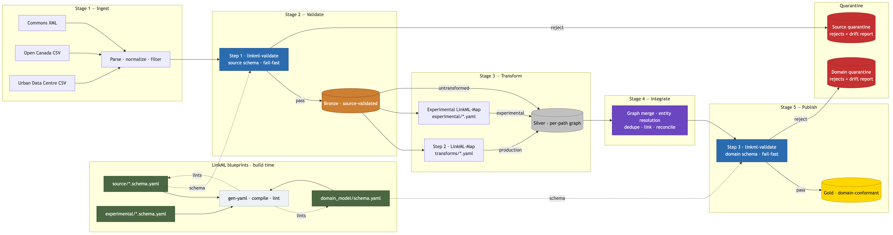

# GCKG — Canadian Governments Knowledge Graph



A schema-first knowledge graph that unifies Canadian federal parliamentary and open-government data into a single, validated, queryable graph.

**Current focus:** End-to-end pipeline on three House of Commons sources — **`commons_members`**, **`commons_members_bylaw`**, and **`commons_members_expenditures`** — from ingest through publish. Justice Canada and Open Canada sources have LinkML schemas or investigation docs but are not wired into the runtime pipeline yet.

## Background

Federal political data in Canada is published across multiple systems with different formats, update cadences, and identifiers. Each source is authoritative for its domain, but none was designed to interoperate. The same person, district, or organization appears under different names and keys in different datasets. Without a shared domain model and a disciplined ingest pipeline, cross-source analysis requires ad hoc joins, brittle one-off scripts, and manual reconciliation whenever a publisher changes shape.

GCKG addresses that fragmentation by treating the knowledge graph as a product: typed entities and relationships, explicit provenance, and validation at every boundary.

## Objective

Build a reproducible pipeline that ingests heterogeneous Canadian government sources and produces a **domain-conformant knowledge graph** suitable for research, civic tooling, and downstream applications (SPARQL, graph databases, API layers).

## Success criteria

The project succeeds when:

1. **End-to-end Commons path** — All three registered Commons sources flow through all five stages (ingest → validate → transform → integrate → publish) and produce Gold-tier graph output.
2. **Schema discipline** — Every record is validated against LinkML schemas at Bronze (source shape) and Gold (domain shape); drift is caught early and rejected records are quarantined with a report.
3. **Declarative transforms** — Bronze-to-domain remapping is defined in YAML transform specs (`transforms/schemas/*.transform.yaml`), executed by `YamlMapEngine` — not buried in per-source Python.
4. **Integrated graph** — Entity resolution and merge produce a single reconciled graph where the same person resolves to one identifier across sources.
5. **Gold-tier output** — Published data passes domain validation and contains only graph-native, domain-conformant assertions.
6. **Reproducibility** — A run can be repeated with the same inputs and schemas to produce an auditable, versioned output.

Additional source families (Justice legislation, Open Canada, Urban Data Centre) extend the same pipeline once the Commons path is stable.

## Getting started

From the repo root:

```bash
python -m venv .venv
source .venv/bin/activate
pip install -e ".[dev,validate]"
```

Run CLIs as modules (`python -m ingest`, etc.) or via console scripts after install:

| Console script | Package | Stage |
|----------------|---------|-------|
| `ingest` | `ingest` | 1 — Ingest |
| `validate` | `validate` | 2 — Validate |
| `transforms` | `transforms` | 3 — Transform |
| `integrate` | `integrate` | 4 — Integrate |
| `publish` | `publish` | 5 — Publish |

Schema paths resolve relative to the repo root — run commands from there.

Lint LinkML blueprints manually when editing schemas:

```bash
cd source && gen-yaml commons_members.schema.yaml
cd domain_model && gen-yaml schema.yaml
```

**Local data dependency:** `commons_members_expenditures` reads a pickle corpus at `data/expense_claims.pkl` (not checked into git). Place the file locally or pass `--input` with `--fetch-policy local-file`.

## Proposed solution

GCKG uses a five-stage medallion pipeline driven by LinkML blueprints at build time and the LinkML validator at runtime.

Pipeline diagram: [`docs/milestone_1/gckg.mmd`](docs/milestone_1/gckg.mmd) (render to PNG for docs if needed).

### Build time — LinkML blueprints

Source schemas, domain model, and transform specs are compiled and linted with `gen-yaml`. These blueprints define what valid source rows, domain entities, and transform derivations look like before any data moves through the pipeline.

### Runtime stages

| Stage | Purpose | Tier |
|-------|---------|------|
| **1 — Ingest** | Parse raw publisher data; schema-driven normalize via `SchemaNormalizer` | — |
| **2 — Validate** | LinkML validation against source schema; optional fail-fast on drift | Bronze |
| **3 — Transform** | YAML transform specs (`map_mode: yaml`) emit Silver graph fragments via `YamlMapEngine` | Silver |
| **4 — Integrate** | Graph merge, dedupe, entity resolution, cross-source linking | Silver (merged) |
| **5 — Publish** | LinkML validation against domain schema | Gold |

Records that fail validation at Stage 2 or Stage 5 are routed to **quarantine** with a drift report rather than silently corrupting downstream tiers.

Stage 2 and Stage 5 use `linkml.validator.Validator` (JSON Schema plugin, closed world) — not a shell-out to the `linkml-validate` CLI.

### Design principles

- **Schema-first** — LinkML is the contract between sources, transforms, and the domain model.
- **Fail-fast gates** — Validate at Bronze (source) and Gold (domain); do not propagate bad rows.
- **Separation of concerns** — Adapters handle publisher format; YAML transform specs handle graph expansion; Integrate handles cross-source reconciliation.
- **Multi-class sources** — Adapters tag each row with `_row_class`; normalize and validate select the matching LinkML class definition.

## End-to-end example

Use a shared `run_id` across stages so paths line up. Members and bylaw can use checked-in fixtures; expenditures needs the local pickle.

```bash
RUN_ID=demo

# Stage 1 — Ingest
python -m ingest run --source commons_members \
  --fetch-policy local-file \
  --input ingest/tests/fixtures/raw/commons_members_sample.xml \
  --run-id $RUN_ID

python -m ingest run --source commons_members_bylaw \
  --fetch-policy local-file \
  --input ingest/tests/fixtures/raw/commons_members_bylaw_sample.xml \
  --run-id $RUN_ID

python -m ingest run --source commons_members_expenditures \
  --run-id $RUN_ID

# Stage 2 — Validate (Bronze)
python -m validate run --source commons_members --staging-run-id $RUN_ID --run-id $RUN_ID
python -m validate run --source commons_members_bylaw --staging-run-id $RUN_ID --run-id $RUN_ID
python -m validate run --source commons_members_expenditures --staging-run-id $RUN_ID --run-id $RUN_ID

# Stage 3 — Transform (Silver per source)
python -m transforms run --source commons_members --bronze-run-id $RUN_ID --run-id $RUN_ID
python -m transforms run --source commons_members_bylaw --bronze-run-id $RUN_ID --run-id $RUN_ID
python -m transforms run --source commons_members_expenditures --bronze-run-id $RUN_ID --run-id $RUN_ID

# Stage 4 — Integrate (merged Silver)
python -m integrate run \
  --input commons_members:$RUN_ID \
  --input commons_members_bylaw:$RUN_ID \
  --input commons_members_expenditures:$RUN_ID \
  --run-id ${RUN_ID}-merged

# Stage 5 — Publish (Gold)
python -m publish run --merged-run-id ${RUN_ID}-merged --run-id $RUN_ID
```

Outputs land under `staging/`, `bronze/`, `silver/`, `silver/merged/`, and `gold/` (all gitignored).

## Milestone 1 — Ingestion pipeline (Stage 1)

Source workflow diagram: [`docs/milestone_1/gckg-sources.mmd`](docs/milestone_1/gckg-sources.mmd).

**Goal:** Stage 1 (Ingest) — a Python runner and adapters that emit source-shaped `records.jsonl` and a provenance `manifest.json` under `staging/`.

**Status:** Platform and three Commons adapters are implemented. Normalization is centralized in `ingest/normalize.py` (`SchemaNormalizer`), driven by LinkML slot ranges rather than per-adapter `normalize()` methods.

Execution plan: [`docs/milestone_1/commons-members-execution-plan.md`](docs/milestone_1/commons-members-execution-plan.md)

| Phase | Work | Status | Output |
|-------|------|--------|--------|
| **1 — Platform** | CLI, adapter protocol + registry, fetch/cache, `sources.yaml`, staging layout, pytest | Done | `python -m ingest run --source …` |
| **2 — Commons sources** | `commons_members`, `commons_members_bylaw`, `commons_members_expenditures` | Done | `staging/{source}/{run_id}/` |
| **3 — Hardening** | `run-all`, additional adapters | Deferred | — |

### Registered sources (today)

```bash
python -m ingest list-sources
# commons_members
# commons_members_bylaw
# commons_members_expenditures
```

| Source | Module | Fetch | Notes |
|--------|--------|-------|-------|
| `commons_members` | `ingest/adapters/commons/members.py` | HTTP or `local-file` | MP XML; field map from `source/commons_members.schema.yaml` |
| `commons_members_bylaw` | `ingest/adapters/commons/members_bylaw.py` | HTTP or `local-file` | Bylaw XML; multi-class rows (sections, paragraphs, defined terms, …) |
| `commons_members_expenditures` | `ingest/adapters/commons/members_expenditures.py` | `local-file` only | Pickle of CSV reports; five row classes (contract, travel, hospitality, …) |

### Done when (Commons ingest)

- [x] Ingest platform: CLI, registry, fetch policies, staging layout
- [x] Three Commons adapters + unit tests (`ingest/tests/adapters/`)
- [x] Source schemas for all three sources under `source/`
- [x] Schema-driven normalization via `SchemaNormalizer`
- [x] No GCKG domain IDs or cross-entity joins in Stage 1 output

## Milestone 2 — Validate pipeline (Stage 2 / Bronze)

**Goal:** Validate Stage 1 `records.jsonl` against LinkML **source schemas** (`source/*.schema.yaml`), write **Bronze** (source-validated records), and route failures to **quarantine** with a drift report.

**Status:** Validate platform and gates for all three Commons sources are implemented. Catalog validation and progress logging for large files remain.

Execution plan: [`docs/milestone_2/validate-execution-plan.md`](docs/milestone_2/validate-execution-plan.md)

| Phase | Work | Status | Output |
|-------|------|--------|--------|
| **1 — Platform** | `validate/` package: CLI, runner, engine, context, errors, `schemas.yaml` | Done | `python -m validate run …` |
| **2 — Commons gates** | Source schemas for members, bylaw, expenditures | Done | `bronze/{source}/{run_id}/` |
| **3 — Tests** | Engine unit tests, staging→Bronze integration on fixtures | Done | `validate/tests/` |
| **4 — Packaging** | `validate` console script, `linkml` optional dep | Done | `pip install -e ".[validate]"` |
| **5 — Hardening** | Catalog validation (ingest sources ∩ schema registry), progress logging | Partial | `--fail-fast` supported |

### How Stage 2 works

1. Read `staging/{source}/{staging_run_id}/records.jsonl` and `manifest.json` (no re-fetch from publishers).
2. Load LinkML source schema from `validate/config/schemas.yaml`.
3. Stream JSONL line-by-line; validate each record with `linkml.validator.Validator`.
4. **Accepted rows** → `bronze/{source}/{validate_run_id}/records.jsonl` + `manifest.json`
5. **Rejected rows** → `quarantine/{source}/{validate_run_id}/rejects.jsonl` + `drift_report.json`

Bronze records are identical to accepted staging rows — no domain IDs, no transform (that is Stage 3).

### Validatable sources (today)

```bash
python -m validate list-sources
# commons_members
# commons_members_bylaw
# commons_members_expenditures
```

### Done when (Commons validate)

- [x] Source schemas define row classes for all three Commons sources
- [x] Staging rows validate; accepted records land in `bronze/`
- [x] Rejected rows and `drift_report.json` land in `quarantine/`
- [x] `validate/tests/` with offline fixtures

## Milestone 3 — Transform pipeline (Stage 3 / Silver)

**Goal:** Transform Bronze records into **Silver graph fragments**, introducing GCKG domain IDs and typed entities/relationships.

**Status:** Platform and YAML-driven transforms for all three Commons sources are implemented and run end-to-end. `YamlMapEngine` (`transforms/map_engine.py`) reads transform specs under `transforms/schemas/` and evaluates `class_derivations` / `slot_derivations` per Bronze row. The legacy Python materializer path remains in the runner but is unused by current sources.

Execution plan: [`docs/milestone_3/transform-execution-plan.md`](docs/milestone_3/transform-execution-plan.md) · expenditures detail: [`docs/milestone_3/expenditures-transform-execution-plan.md`](docs/milestone_3/expenditures-transform-execution-plan.md)

| Phase | Work | Status | Output |
|-------|------|--------|--------|
| **0 — Domain prep** | `house_of_commons.yaml`, `bylaw.yaml`, expenditure classes | Done | `gen-yaml` passes |
| **1 — Platform** | `transforms/` package: CLI, runner, engine, context, config registry | Done | `python -m transforms run …` |
| **2 — YAML map engine** | `YamlMapEngine` + `map_mode: yaml` in `maps.yaml` | Done | No per-source Python materializer needed |
| **3 — Commons transforms** | Three `.transform.yaml` specs under `transforms/schemas/` | Done | Person, MP, bylaw structure, expense claims, relationships |
| **4 — Experimental lane** | Opt-in experimental maps via CLI flag | Not started | — |
| **5 — Tests + packaging** | `transforms/tests/test_map_engine.py`, `transforms` console script | Done | Wired in `pyproject.toml` |

### How Stage 3 works

1. Read `bronze/{source}/{bronze_run_id}/records.jsonl`.
2. Look up the source in `transforms/config/maps.yaml` and load its transform spec.
3. Stream Bronze JSONL; for each row, `YamlMapEngine` dispatches on `_row_class` and emits one or more graph fragments.
4. Write **`silver/{source}/{run_id}/fragments.jsonl`** — typed nodes and reified relationship edges.
5. Write **`silver/{source}/{run_id}/quarantine.jsonl`** (rows that failed materialization) and **`manifest.json`**.

Silver is **per-source** graph fragments. Cross-source merge is Stage 4 (Integrate).

### Transform specs (today)

| Source | Spec | Domain coverage (high level) |
|--------|------|------------------------------|
| `commons_members` | `transforms/schemas/commons_members_to_gckg.transform.yaml` | Person, MemberOfParliament, tenure triple |
| `commons_members_bylaw` | `transforms/schemas/commons_members_bylaw_to_gckg.transform.yaml` | ByLaw document structure, defined terms, cross-references |
| `commons_members_expenditures` | `transforms/schemas/commons_members_expenditures_to_gckg.transform.yaml` | Expense reports, claims, Person stubs, relationships |

### Done when (Commons transform)

- [x] All three Commons sources materialize Silver graph fragments
- [x] GCKG IDs are deterministic and source-scoped (e.g. `gckg:Person:Commons:{id}`)
- [x] Every Silver fragment carries a `bronze_reference` back to Bronze
- [x] `transforms/tests/` with offline fixtures
- [ ] Materialize District + Seat + Party + named tenure triples for members (with name-based slugs)

## Milestone 4 — Integrate pipeline (Stage 4 / Silver merged)

**Goal:** Merge per-source **Silver fragments** into a single reconciled graph under `silver/merged/{run_id}/` — dedupe nodes and edges by GCKG URI, preserve provenance, and resolve cross-source entities.

**Status:** Implemented. The `integrate/` package merges multiple Silver runs, normalizes legacy `rel_type` → `predicate`, dedupes by canonical URI, and supports pluggable `EntityResolver` implementations. A `commons_person` resolver links expenditure Person stubs to canonical members Person URIs via a Bronze-derived crosswalk.

Execution plan: [`docs/milestone_4/integrate-execution-plan.md`](docs/milestone_4/integrate-execution-plan.md)

| Phase | Work | Status | Output |
|-------|------|--------|--------|
| **1 — Platform** | `integrate/` package: CLI, runner, engine, context, errors, resolvers | Done | `python -m integrate run …` |
| **2 — Node merge** | Group fragments by canonical GCKG URI; union attributes + provenance | Done | `silver/merged/{run_id}/nodes.jsonl` |
| **3 — Edge normalize + dedupe** | `rel_type`→`predicate`; dedupe by id or `(s,p,o)` | Done | `silver/merged/{run_id}/edges.jsonl` |
| **4 — Resolver hook** | `EntityResolver` + `IdentityResolver` default + `CommonsPersonResolver` | Done | pluggable via `--resolver` |
| **5 — Tests + packaging** | Resolver tests, `integrate` console script | Done | `integrate/tests/` |

### How Stage 4 works

1. Read one or more `silver/{source}/{silver_run_id}/fragments.jsonl` inputs.
2. Classify each fragment as a **node** (keyed by `id`) or an **edge** (has `subject` + `object`).
3. Apply an `EntityResolver` to map each id to a **canonical** GCKG URI (default: identity).
4. Merge nodes by canonical id and edges by merge key, unioning `bronze_references` and `sources`.
5. Write **`silver/merged/{run_id}/nodes.jsonl`** + **`edges.jsonl`** (sorted, deterministic), **`manifest.json`**, **`resolution_report.json`**, and route shape errors to **`quarantine.jsonl`**.

### Resolvers

| Resolver | Factory path | Purpose |
|----------|--------------|---------|
| `IdentityResolver` (default) | `integrate.resolvers.identity.get_resolver` | Exact-URI merge |
| `CommonsPersonResolver` | `integrate.resolvers.commons_person.get_resolver` | Map expenditure Person stubs → members Person URIs |

### Done when (Commons integrate)

- [x] `integrate/` package with CLI and runner
- [x] Nodes sharing a GCKG URI collapse to one with unioned provenance
- [x] Edges normalized and deduped
- [x] Same inputs → deterministic merged output
- [x] `EntityResolver` hook with identity default and commons_person crosswalk
- [x] `integrate/tests/` with offline fixtures

## Milestone 5 — Publish pipeline (Stage 5 / Gold)

**Goal:** Validate merged Silver nodes and edges against the LinkML **domain schema** (`domain_model/schema.yaml`) and write **Gold** output.

**Status:** Implemented. The `publish/` package streams merged `nodes.jsonl` and `edges.jsonl`, strips provenance keys before validation, and routes domain-invalid fragments to Gold quarantine.

| Phase | Work | Status | Output |
|-------|------|--------|--------|
| **1 — Platform** | `publish/` package: CLI, runner, engine, context | Done | `python -m publish run …` |
| **2 — Domain gate** | LinkML validation per fragment `@type` | Done | `gold/{run_id}/nodes.jsonl` + `edges.jsonl` |
| **3 — Quarantine** | Rejected nodes/edges with validation errors | Done | `gold/{run_id}/quarantine/` |
| **4 — Tests** | Publish integration tests | Not started | `publish/tests/` (referenced in `pyproject.toml` but not yet present) |

### How Stage 5 works

1. Read `silver/merged/{merged_run_id}/nodes.jsonl` and `edges.jsonl`.
2. Strip provenance keys (`bronze_references`, `sources`, `bronze_reference`, …).
3. Validate each fragment against `domain_model/schema.yaml` with `linkml.validator.Validator`.
4. **Accepted** → `gold/{run_id}/nodes.jsonl` + `edges.jsonl` + `manifest.json`
5. **Rejected** → `gold/{run_id}/quarantine/nodes.jsonl` + `edges.jsonl`

### Done when (Commons publish)

- [x] `publish/` package with CLI and runner
- [x] Merged Silver validates against domain schema
- [x] Accepted fragments land in `gold/`; rejects in quarantine
- [ ] `publish/tests/` with offline fixtures

## Related tools

| Tool | Path | Purpose |
|------|------|---------|
| Neo4j import | `tools/neo4j_import/` | Preprocess Silver or merged output to Neo4j admin-import CSVs |
| Source investigator | `tools/source_investigator/` | Profile raw sources and draft LinkML schema proposals |
| Ontology insights | `tools/ontology_insights/` | Structural analysis of LinkML/OWL schemas |

See [`docs/sop_silver_to_neo4j.md`](docs/sop_silver_to_neo4j.md) for the Neo4j load workflow.

## Investigation-only sources

These have LinkML source schemas and impact assessments under `docs/source_investigator/` but no ingest adapter or pipeline registration yet:

| Source | Schema | Assessment |
|--------|--------|------------|
| Justice legislation catalog | `source/justice_legis_catalog.schema.yaml` | [`docs/source_investigator/assessments/justice_legis_catalog.md`](docs/source_investigator/assessments/justice_legis_catalog.md) |
| Justice statute (Part I) | `source/justice_statute_p1.schema.yaml` | [`docs/source_investigator/assessments/justice_statute_p1.md`](docs/source_investigator/assessments/justice_statute_p1.md) |

## File layout

```
gckg/
├── pyproject.toml                          package: gckg-ingest (all five stages)
│
├── domain_model/                           LinkML domain schema · Stage 5 Publish gate
│   ├── schema.yaml                         root import
│   ├── foundation/
│   │   ├── prefixes.yaml
│   │   ├── types.yaml                      Person, Organization, Role, …
│   │   └── slots.yaml                      shared slot definitions
│   └── domains/
│       ├── house_of_commons.yaml           MPs, districts, expenditure classes
│       ├── bylaw.yaml                      bylaw document structure
│       └── business.yaml                   shared business types
│
├── source/                                 LinkML source schemas · Stage 2 Validate gate
│   ├── commons_members.schema.yaml
│   ├── commons_members_bylaw.schema.yaml
│   ├── commons_members_expenditures.schema.yaml
│   ├── justice_legis_catalog.schema.yaml   (investigation only)
│   └── justice_statute_p1.schema.yaml      (investigation only)
│
├── ingest/                                 Python package · Stage 1 Ingest
│   ├── cli.py, runner.py, context.py
│   ├── normalize.py                        SchemaNormalizer (schema-driven coercion)
│   ├── schema.py                           publisher_header → slot map
│   ├── fetch/                              HTTP, conditional GET, local-file
│   ├── adapters/commons/                   members, members_bylaw, members_expenditures
│   ├── config/sources.yaml
│   └── tests/
│
├── validate/                               Python package · Stage 2 Validate
│   ├── cli.py, runner.py, engine.py
│   ├── config/schemas.yaml
│   └── tests/
│
├── transforms/                             Python package · Stage 3 Transform
│   ├── cli.py, runner.py, engine.py
│   ├── map_engine.py                       YamlMapEngine (active runtime)
│   ├── config/maps.yaml                    source → transform spec + map_mode
│   ├── schemas/                            *.transform.yaml specs (executed at runtime)
│   └── tests/
│
├── integrate/                              Python package · Stage 4 Integrate
│   ├── cli.py, runner.py, engine.py
│   ├── resolvers/                          identity, commons_person, crosswalk
│   └── tests/
│
├── publish/                                Python package · Stage 5 Publish
│   ├── cli.py, runner.py, engine.py
│   └── context.py
│
├── tools/
│   ├── neo4j_import/                       Silver/merged → Neo4j CSV
│   ├── source_investigator/                source profiling
│   └── ontology_insights/                  schema analysis
│
├── staging/                                gitignored · Stage 1 output
├── bronze/                                 gitignored · Stage 2 output
├── quarantine/                             gitignored · Stage 2 + transform rejects
├── silver/                                 gitignored · Stage 3 (per-source) + Stage 4 (merged)
└── gold/                                   gitignored · Stage 5 output
```
